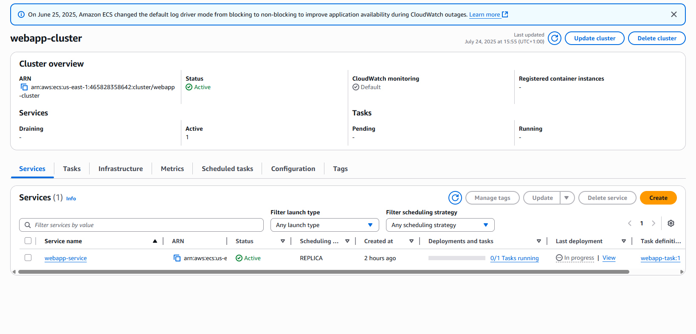
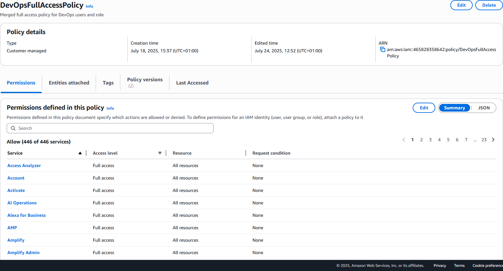
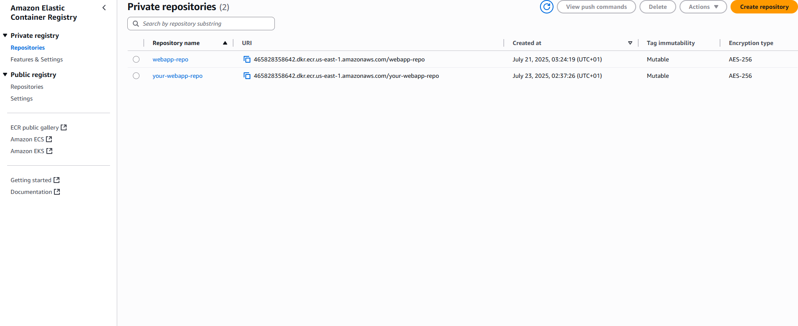
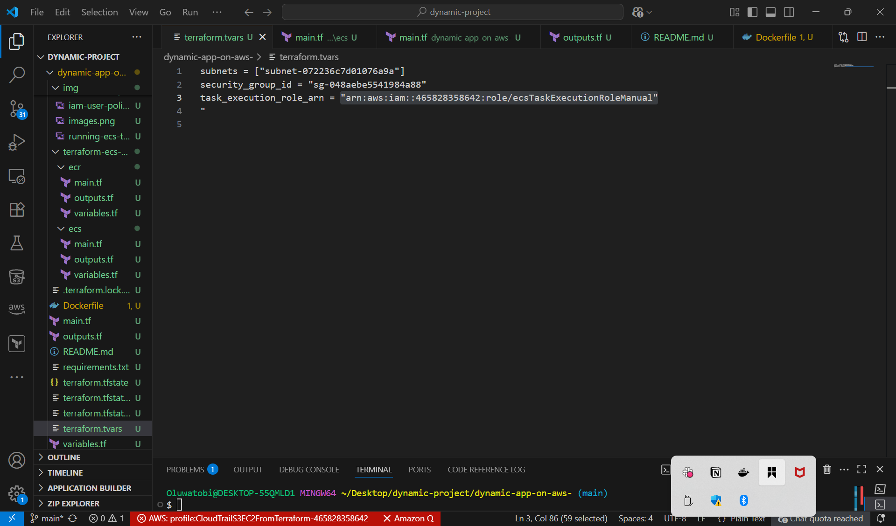
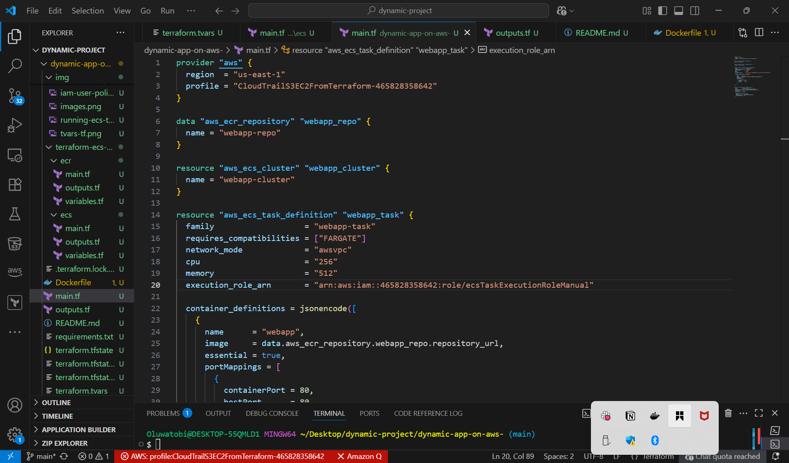

# 🚀 MINI PROJECT: Hosting A Dynamic Web App on AWS With Terraform Module, Docker, Amazon ECR, ECS

---

## 📌 Project Objectives

* Deploy a containerized web application using AWS ECS Fargate
* Manage AWS infrastructure as code via Terraform
* Store Docker images on Amazon ECR
* Practice IAM role management and ECS networking setup

---

## 📋 Prerequisites

* An active AWS account
* AWS CLI configured with appropriate IAM permissions
* Terraform installed (≥ 1.0.0)
* Docker installed and running
* Visual Studio Code (optional but recommended)

---

## 🧱 Technologies Used

* **Terraform** for Infrastructure as Code
* **AWS ECS** (Fargate launch type)
* **Amazon ECR** for container image storage
* **AWS IAM** for secure task execution
* **AWS VPC, Subnets & Security Groups** for networking
* **Docker** to containerize the application

---

## 🧭 Project Structure

```bash
.
├── terraform-ecs-webapp
│   ├── modules
│   │   ├── ecr
│   │   │   └── main.tf
│   │   └── ecs
│   │       └── main.tf
│   ├── main.tf
│   ├── variables.tf
│   ├── outputs.tf
│   ├── terraform.tfvars
├── Dockerfile
├── app.py / index.html (your app files)
├── requirements.txt
├── terraform.tfstate
├── terraform.lock.hcl
└── README.md
```

---

## 📷 Screenshots


> 📸 ECS Service Console

* 


> 📸 IAM Role with Policies

* 


> 📸 ECR Repository

* 


> 📸 Running Task in ECS

* [running-task](./img/running-ecs-task.png)


---


## 🧰 Terraform Scripts Used

### `terraform.tfvars`

```hcl
subnets               = ["subnet-072236c7d01076a9a"]
security_group_id     = "sg-048aebe5541984a88"
task_execution_role_arn = "arn:aws:iam::465828358642:role/ecsTaskExecutionRoleManual"
```

* 

### `main.tf`

```hcl
provider "aws" {
  region  = "us-east-1"
}

data "aws_ecr_repository" "webapp_repo" {
  name = "webapp-repo"
}

resource "aws_ecs_cluster" "webapp_cluster" {
  name = "webapp-cluster"
}

resource "aws_ecs_task_definition" "webapp_task" {
  family                   = "webapp-task"
  requires_compatibilities = ["FARGATE"]
  network_mode             = "awsvpc"
  cpu                      = "256"
  memory                   = "512"
  execution_role_arn       = var.task_execution_role_arn

  container_definitions = jsonencode([
    {
      name      = "webapp",
      image     = data.aws_ecr_repository.webapp_repo.repository_url,
      essential = true,
      portMappings = [
        {
          containerPort = 80,
          hostPort      = 80,
          protocol      = "tcp"
        }
      ]
    }
  ])
}

resource "aws_ecs_service" "webapp_service" {
  name            = "webapp-service"
  cluster         = aws_ecs_cluster.webapp_cluster.id
  task_definition = aws_ecs_task_definition.webapp_task.arn
  desired_count   = 1
  launch_type     = "FARGATE"

  network_configuration {
    subnets          = var.subnets
    security_groups  = [var.security_group_id]
    assign_public_ip = true
  }
}
```

* 


### `variables.tf`

```hcl
variable "subnets" {
  type = list(string)
}

variable "security_group_id" {
  type = string
}

variable "task_execution_role_arn" {
  type = string
}
```

* 


### `outputs.tf`

```hcl
output "ecs_service" {
  value = aws_ecs_service.webapp_service.name
}

output "repository_url" {
  value = data.aws_ecr_repository.webapp_repo.repository_url
}
```

* 

---

## 🚀 Deployment Commands

### 1. Configure AWS CLI

```bash
aws configure --profile my-profile
```

### 2. Initialize Terraform

```bash
terraform init
```

### 3. Plan your deployment

```bash
terraform plan -var-file="terraform.tfvars"
```

### 4. Apply the configuration

```bash
terraform apply -var-file="terraform.tfvars"
```

### 5. Destroy when done (cleanup)

```bash
terraform destroy -var-file="terraform.tfvars"
```

---

## ❗ Challenges Faced

* IAM `AccessDenied` errors when referencing roles not owned by the correct account
* Invalid ARN format when using assumed roles instead of IAM roles
* ECS cluster timeout due to incorrect region mismatch
* `InvalidGroupId.Malformed` caused by quoting SG IDs incorrectly
* `Unable to assume the service linked role` due to missing ECS service-linked role
* Security token invalid due to wrong AWS profile configuration

---

## ✅ Outcome

* ✅ ECS Fargate Service deployed
* ✅ Docker image pulled from ECR
* ✅ IAM execution role properly applied
* ✅ All AWS resources are managed via Terraform

---

## 📁 GitHub Repository

This project is hosted at:
🔗 **[https://github.com/Techytobii/dynamic-app-on-aws-](https://github.com/Techytobii/dynamic-app-on-aws-)**

You can clone the repository using:

```bash
git clone https://github.com/Techytobii/dynamic-app-on-aws-.git
cd dynamic-app-on-aws-
```

---

Feel free to clone, extend, or fork this project for your own AWS-based deployments.

---# dynamic-app-on-aws-
